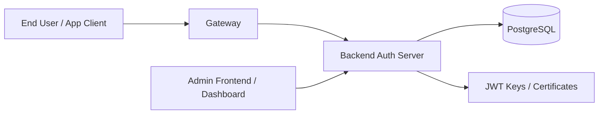

# Ktor OAuth2 Multi-Tenant Auth Server

A Kotlin + Ktor-based identity platform for running a multi-tenant OAuth 2.0 / OpenID Connect authorization server with a tenant-aware admin dashboard, role management, password resets, and 2FA support.

Current release: `v1.0.0.alpha22`

This project extends the base Ktor OAuth authorization server with business features such as tenancy, custom tenant templates, client management, user administration, and a gateway-backed deployment model.

## Why this project

- Multi-tenant auth and login experience
- OAuth2 and OIDC support out of the box
- A configurable admin UI for users, clients, roles, and tenants
- 2FA and trusted-device handling
- Docker-first setup for local and hosted deployments
- Friendly for SaaS, internal identity platforms, and platform auth systems

## Architecture



The repository is split into three main pieces:

- `backend/` — the Ktor OAuth2 / OIDC authorization server and admin APIs
- `frontend/` — the dashboard SPA used to manage clients, users, roles, and tenants
- `gateway/` — a lightweight gateway service that routes traffic to the backend

## Core features

- OAuth 2.0 Authorization Code flow
- Client Credentials flow
- Refresh token support
- OpenID Connect (OIDC) discovery
- JWT issuance and JWKS publishing
- Device authorization flow support
- Multi-tenant database and routing model
- Tenant-specific templates, branding, and login customization
- User management and role-based access
- Password reset support
- Two-factor authentication (2FA)
- Secure session handling and cookie-based login flows
- Swagger / API documentation support
- Docker-enabled deployment

## Project layout

```text
.
├── backend/                     # Main Ktor authorization server
├── frontend/                    # KVision-based admin dashboard
├── gateway/                     # Proxy / gateway service
├── application-backend.yaml     # Backend runtime configuration
├── application-gateway.yaml     # Gateway runtime configuration
├── docker-compose.yaml          # Local docker deployment
├── Dockerfile                   # Container build definition
├── info.json                    # App version metadata
├── entrypoint.sh                # Container entry script
└── README.md                    # Project documentation
```

## Quick start with Docker

### Prerequisites

- Docker
- Docker Compose
- A PostgreSQL instance, or a local containerized database
- JWT signing keys (recommended to generate your own)

### 1) Clone the project

```bash
git clone https://github.com/bittokazi/ktor-oauth2-multi-tenant-auth-server.git
cd ktor-oauth2-multi-tenant-auth-server
```

### 2) Configure certificates

Generate your own keys before running in production or even for local testing:

```bash
openssl genrsa -out default_private_key.pem 4096
openssl rsa -pubout -in default_private_key.pem -out default_public_key.pem
openssl pkcs8 -topk8 -in default_private_key.pem -inform pem -out default_private_key_pkcs8.pem -outform pem -nocrypt
```

Then point your backend config to those files in `application-backend.yaml`:

```yaml
jwk:
  key-id: "my-key-id"
  private-key-path: certificates/default_private_key_pkcs8.pem
  public-key-path: certificates/default_public_key.pem
```

### 3) Pull the image

```bash
docker pull bittokazi/ktor-oauth2-multi-tenant-auth-server:latest
```

### 4) Start the stack

Create a `docker-compose.yml` file with the following content:

```yaml
services:
  app:
    image: bittokazi/ktor-oauth2-multi-tenant-auth-server:v1.0.0.alpha18
    ports:
      - "0.0.0.0:5035:5035"
    volumes:
      - /home/bitto/Documents/kotlin/templates/data:/app/data
      - ./application-backend.yaml:/app/application-backend.yaml
      - ./application-gateway.yaml:/app/application-gateway.yaml
```

Then run:

```bash
docker compose up -d
```

This project ships with a `docker-compose.yaml` that exposes the app through the gateway on:

- Dashboard: http://localhost:5035/app/dashboard
- Dashboard login: http://localhost:5035/app/login
- Swagger: http://localhost:5035/swagger
- Base app URL: http://localhost:5035

The default admin account is:

- Username: `admin@example.com`
- Password: `password`

## Local configuration

The backend config is driven by `application-backend.yaml` and includes the database, JWT settings, OAuth settings, app modules, and mail configuration.

### Backend config (`application-backend.yaml`)

```yaml
ktor:
  application:
    modules:
      - ktor.oauth2.multi.tenant.auth.server.ApplicationKt.module
  deployment:
    port: 8081

databases:
  default:
    url: jdbc:postgresql://172.17.0.1:5432/ktor_auth_db
    driver: "org.postgresql.Driver"
    schema: "public"
    username: postgres
    password: password

jwk:
  key-id: "my-key-id"
  private-key-path: certificates/default_private_key_pkcs8.pem
  public-key-path: certificates/default_public_key.pem

idp-client-config:
  enabled: true

oauth:
  enabled: true
  issuer: "http://0.0.0.0:5035"
  no-redirect-clients: []
  session:
    timeout: 3600
    encryption-key: dd78055a2c57f50a636efe0e034764f8
    signing-key: a94f3c2e8b7f5d4c1e0296a1b3d8f7e8

app:
  name: "AuthKit"
  domain: http://0.0.0.0:5035
  template-folder: /app/data
  documentation:
    enabled: true
  health-endpoint:
    enabled: true
  modules:
    USER:
      enabled: true
    CLIENT:
      enabled: true
    CPANEL:
      enabled: true
    PASSWORD_RESET:
      enabled: true
    ROLE:
      enabled: true
    TENANT:
      enabled: true

mail-config:
  enabled: true
  host: smtp.example.com
  port: 587
  auth: true
  starttls: true
  from: "no-reply@example.com"
  username: "your-email@example.com"
  password: "your-mail-password"
```

### Gateway config (`application-gateway.yaml`)

```yaml
ktor:
  application:
    modules:
      - com.bittokazi.ktor.auth.gateway.ApplicationKt.module
  deployment:
    port: 5035

proxy:
  enabled: true
  routes:
    "":
      - prefix: /
        target: http://127.0.0.1:8081
```

### Docker Compose example

```yaml
services:
  app:
    image: bittokazi/ktor-oauth2-multi-tenant-auth-server:v1.0.0.alpha18
    ports:
      - "0.0.0.0:5035:5035"
    volumes:
      - /home/bitto/Documents/kotlin/templates/data:/app/data
      - ./application-backend.yaml:/app/application-backend.yaml
      - ./application-gateway.yaml:/app/application-gateway.yaml
```

Important:

- Keep the session encryption/signing keys stable across restarts.
- Prefer your own generated RSA keys in production.
- Update the issuer and domain values for your environment.

## OAuth and OIDC capabilities

The backend configures the Ktor OAuth authorization server with the standard endpoints, including:

- `GET /oauth/authorize`
- `POST /oauth/token`
- `POST /oauth/revoke`
- `POST /oauth/introspect`
- `GET /oauth/userinfo`
- `GET /.well-known/openid-configuration`
- `GET /.well-known/jwks.json`

This makes the system compatible with standard OAuth 2.0 and OIDC clients, while the tenant-aware backend adds domain-specific auth flows and admin logic.

## Multi-tenant model

This project is explicitly built around tenants. Each tenant can have its own domain configuration, custom templates, login experience, and user base. Tenant metadata is managed through the application layers and used to route requests and isolate resources.

When a tenant is created, its login URL is typically:

- http://tenant-domain/app/login

A default user is automatically created for each new tenant with the following credentials:

- Username: `admin@example.com`
- Password: `password`

Typical tenant features include:

- tenant creation and update via dashboard
- tenant-specific branding and template assets
- tenant-aware user, client, and role data
- domain-based or company-key-based tenant resolution

## Custom templates

You can customize the login, consent, and other OAuth pages by creating Mustache templates in a tenant-specific template folder. The project supports template customization for tenant-specific branding, login forms, and consent screens.

A simple example is `login.hbs`:

```html
<!DOCTYPE html>
<html lang="en">
<head>
    <meta charset="UTF-8">
    <meta name="viewport" content="width=device-width, initial-scale=1.0">
    <title>Login to IDP Cloud</title>
    <link rel="stylesheet" href="{{resourceBase}}/css/style.css">
</head>
<body>
<div class="login-container">
    <h2>Login to IDP Cloud</h2>

    {{#error}}
        <div class="error" id="errorMessage">{{errorMessage}}</div>
    {{/error}}

    <form method="POST" action="/oauth/login">
        <input type="hidden" name="redirect" value="{{redirect}}" />

        <input type="text" name="username" placeholder="Email" required autofocus>
        <input type="password" name="password" placeholder="Password" required>

        <div class="remember-me">
            <input type="checkbox" id="remember" name="rememberMe" value="true">
            <label for="remember">Remember me</label>
        </div>

        <button type="submit">Login</button>
    </form>
</div>
</body>
</html>
```

The template uses standard Mustache variables such as `{{redirect}}`, `{{errorMessage}}`, and `{{resourceBase}}` for dynamic rendering.

A sample template set is included in the `example-template` directory. For example:

- `example-template/oauth_templates/login.hbs`

This folder is meant to be used as a reference when creating your own tenant templates.

### Uploading templates in the dashboard

To upload a custom template package:

1. Go to the template folder you want to package.
2. Select all files in that folder.
3. Create a zip archive containing those files.
4. Open the dashboard and upload the zip file from the tenant template section.

The uploaded zip should contain the template files in the correct folder structure for the app to render them correctly.

## Admin dashboard

The frontend module provides a management dashboard for admins to work with:

- Users
- Clients
- Roles
- Tenants
- Password reset workflows
- Security / account settings

This gives the project a full admin UX instead of only exposing raw OAuth endpoints.

## Local development

### Backend

```bash
cd backend
./gradlew run
```

### Gateway

```bash
cd gateway
./gradlew run
```

### Frontend

```bash
cd frontend
./gradlew run
```

The gateway is useful when you want to expose the full auth server under a single entry point while keeping the backend and dashboard separated.

## Helpful notes

- The project uses PostgreSQL as the primary backend data store.
- It is designed for local testing and production-style deployment via Docker.
- The login and consent templates are configurable and can vary per tenant.
- 2FA is supported through the security layer and user configuration.

## Contributing

Contributions are welcome. If you want to improve the auth flows, deployment process, docs, or admin tooling, open a pull request and share your changes.

## License

This project is licensed under the terms defined in the repository. Please review the project license file before production use.

---

Built with Ktor, Kotlin, PostgreSQL, and a multi-tenant authentication model for modern identity workloads.
